# Trabalho_PHP
Trabalho institucional do curso Tecnico em Informatica da EEEP MANOEL MANO da disciplina de Banco de Dados, ministrada pelo professor Adeilson Sales Aragão.

# *Introdução ao Sistema ADR:*
O Sistema ADR foi desenvolvido para armazenar, cadastrar, editar e organizar os dados de alunos, bem como possibilitar o usuario realizar buscas, consultas e filtragem dos dados dos alunos cadastrados, permitindo um dinamismo e praticidade na utilização de dados.

Todo o front-end é pensado seguindo os padrões de uma GUI (Graphical User Interface). Como visto nas 3 imagens abaixo, toda a interface foi desenvolvida em facilitar e simplificar o maximo possivel a utilização do sitema pelo usuário sem prejudicar a eficiencia total entregue pelo sistema.
Segue abaixo as imagens das paginas de 'Home' (página inicial e Dashboard), 'Cadastro' (página de cadastro dos alunos) e 'Listar' (página que contém a lista de alunos cadastrados e funcionalidades de editar e excluir os dados), respectivamente.

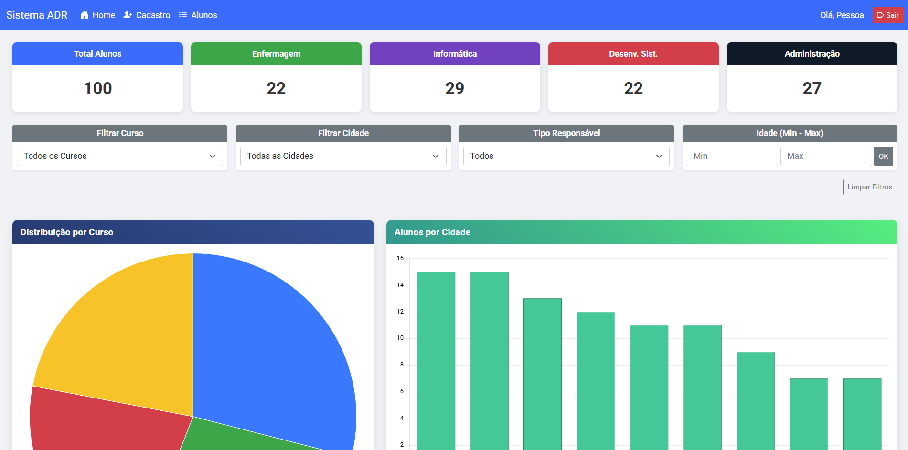

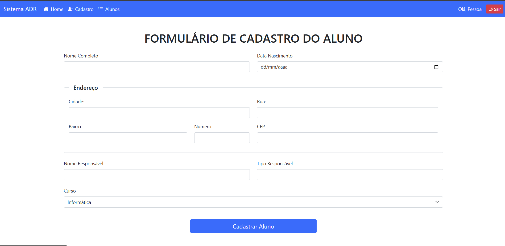

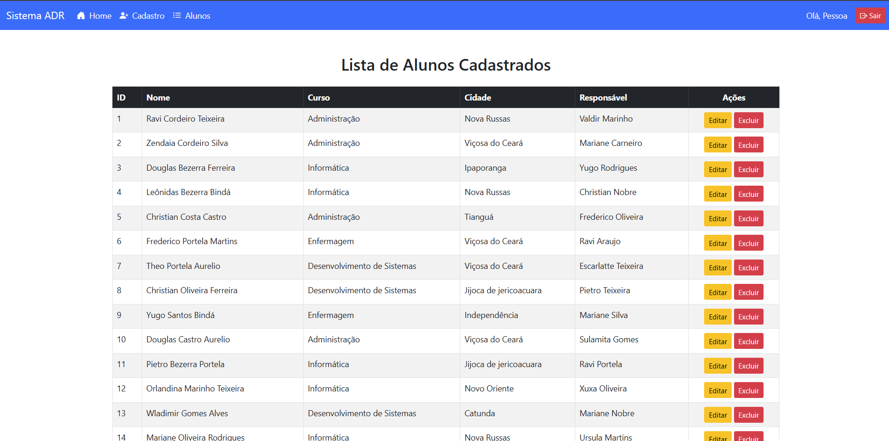

# *Tecnologias Utilizadas:*

* **Back-end:** PHP;
* **Banco de Dados:** MySQL;
* **Front-end:** HTML5, CSS3 e Bootstrap;
* **Servidor:** Apache XAMPP.

# *Codigo SQL:*
Criação da tabela users:
'''CREATE TABLE users (
    user_id INT AUTO_INCREMENT PRIMARY KEY,
    user_name VARCHAR(100) NOT NULL,
    user_email VARCHAR(150) NOT NULL UNIQUE,
    user_password VARCHAR(255) NOT NULL
);'''

Criação da tabela alunos:
'''CREATE TABLE alunos (
    id INT AUTO_INCREMENT PRIMARY KEY,
    nome VARCHAR(255) NOT NULL,
    data_nascimento DATE NOT NULL,
    cidade VARCHAR(100),
    rua VARCHAR(255),
    bairro VARCHAR(100),
    numero VARCHAR(20),
    cep VARCHAR(10),
    nome_responsavel VARCHAR(255),
    tipo_responsavel VARCHAR(50),
    curso VARCHAR(100) NOT NULL,
    data_cadastro TIMESTAMP DEFAULT CURRENT_TIMESTAMP
);'''

# *Consultas:*

Nosso dashboard é composto por uma parte superior com 5 cards, mostrando o total de alunos para cada curso. Logo abaixo, temos os filtros, que podem filtar o curso, cidade, tipo de responsável e intervalo de idade. Representado na imagem abaixo:

Logo abaixo, temos três tipos de gráficos: de pizza sobre alunos por cursos, de barras vertical sobre as alunos por cidades e de barras horizontal de alunos por idade. Por último, temos cards especeiais que mostram o curso mais procurado e a cidade com mais alunos. Com isso, abaixo temos uma lista contendo 10 exemplos de possíveis consultas que podem ser realizadas pelo dashboard do nosso sistema.

* Consulta 1: **Distribuição total de alunos por curso**
  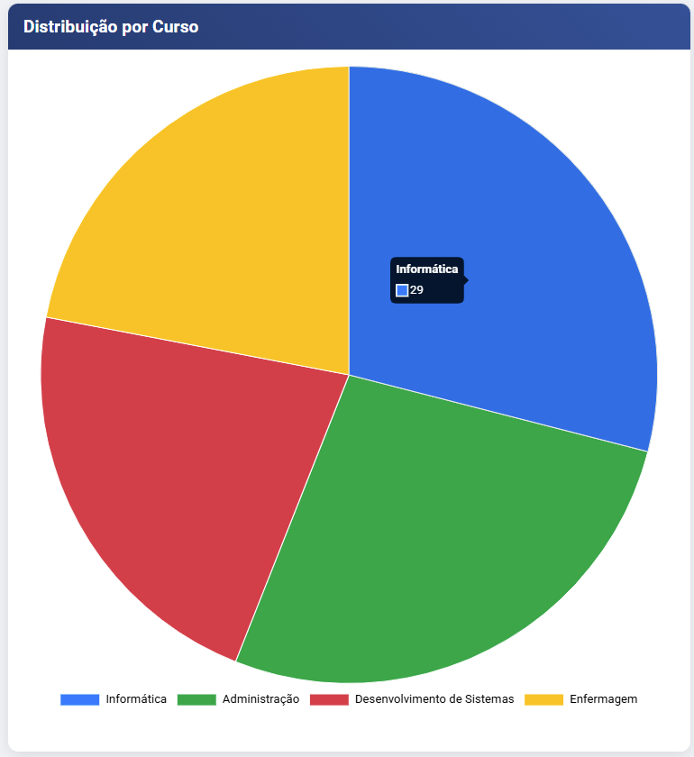
  
* Consulta 2: **Distribuição de alunos de Crateús por curso**
   

* Consulta 3: **Distribuição total de alunos por cidade**
  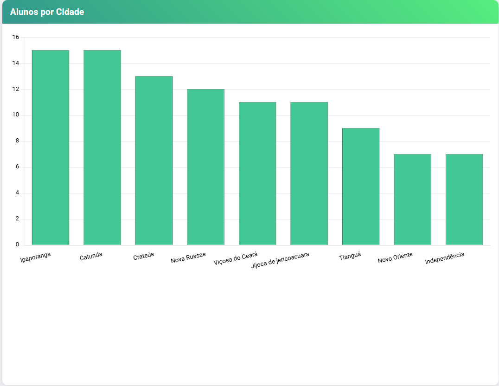 
   
* Consulta 4: **Distribuição de alunos do curso de informatica por cidade**
  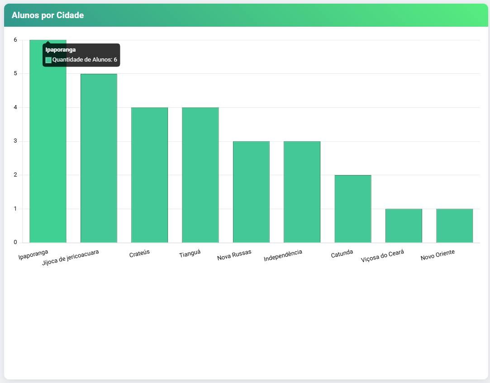 
  
* Consulta 5: **Distribuição total de alunos por idade**
  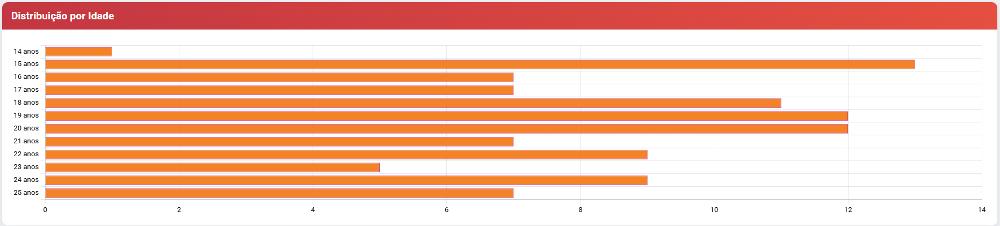
   
* Consulta 6: **Distribuição de alunos por idade do curso de informatica**
  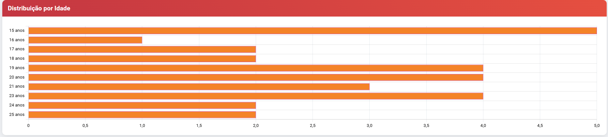
  
* Consulta 7: **Curso geral mais procurado**
  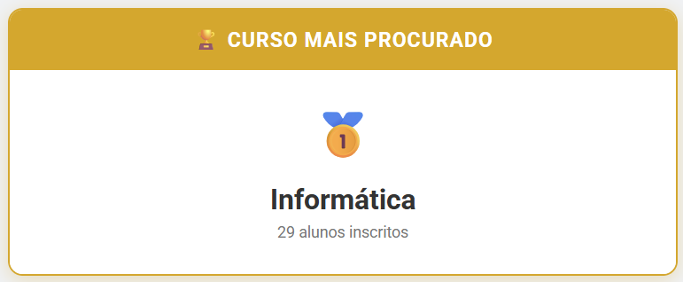
  
* Consulta 8: **Curso geral mais procurado dos alunos da cidadde Jijoca de Jericoacoara**
  
   
* Consulta 9: **Cidade com mais alunos cadastrados**
  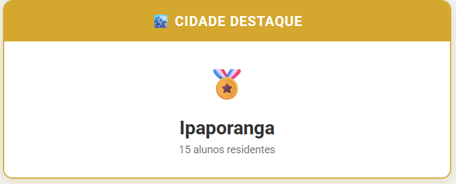
   
* Consulta 10: **Cidade com mais alunos cadastrados no curso de Informatica**
  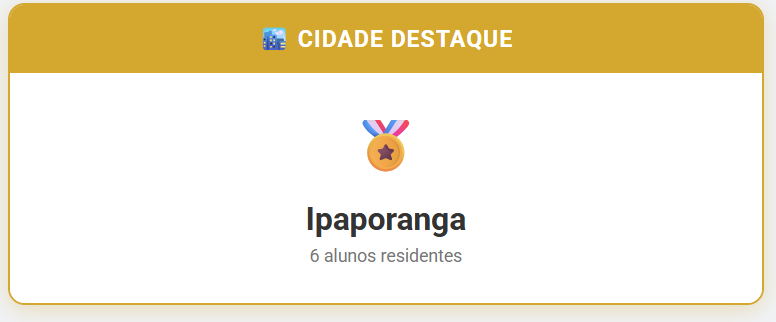
  

# *Conclusão:*
Por fim, nosso trabalho de um sistema genérico de um banco de dados de alunos mostra o quão importante e necessário é a utilização de um banco de dados com um front-end organizado e prático, permitindo uma eficiência e resultados mais concretos no trabalho dos dados. Além disso, o sistema também apresenta a importância do estudo das tecnologias utilizadas, como o PHP, SQL e Bootsrap na construção de sistemas e banco de dados, figuras chave do avanço tecnologico atual.

